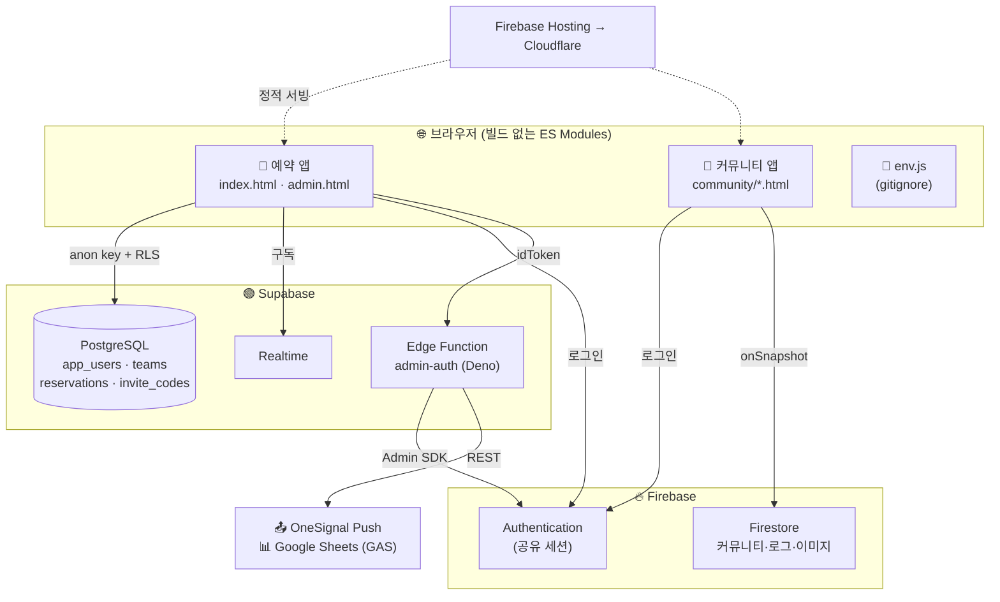
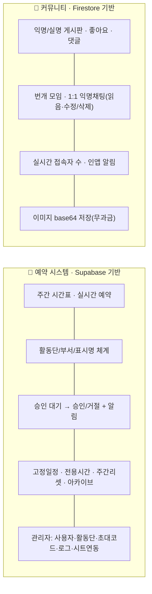
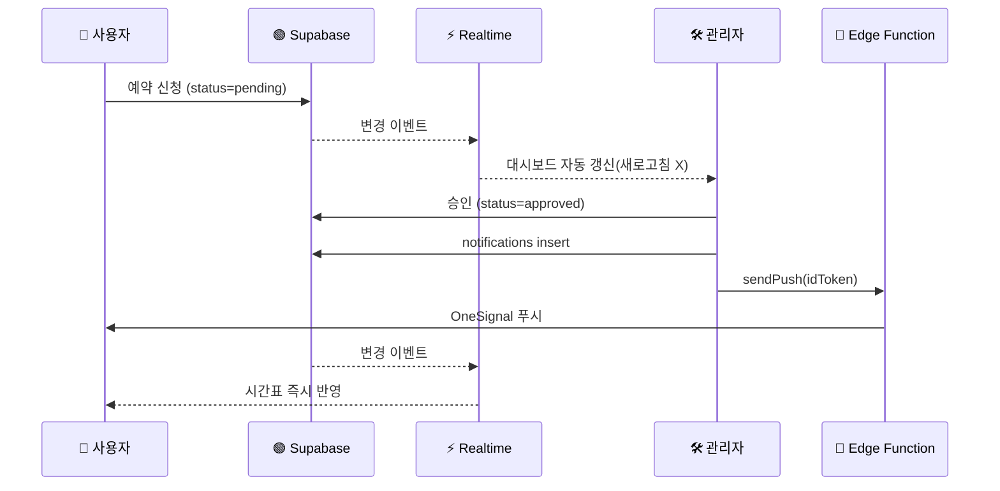

<div align="center">

# 🏛️ 유스나루 공간 예약 시스템

**서울시립마포청소년센터 유스나루** 활동단 공간 예약 + 청소년 커뮤니티 플랫폼

🔗 **[youthnaroo.xyz](https://youthnaroo.xyz)**

<br>


</div>

---

## 📊 한눈에 보기

| | | |
|---|---|---|
| 🧩 **빌드 도구** | 없음 — 순수 ES Modules, HTML 직접 서빙 | `0` 번들러 |
| 🗄️ **데이터베이스** | Supabase(PostgreSQL) + Firebase Firestore 하이브리드 | `2` 종 |
| ⚡ **실시간** | Supabase Realtime + Firestore onSnapshot | 예약·알림·채팅 즉시 반영 |
| 🧱 **앱** | 예약 시스템 + 청소년 커뮤니티 | `2` 개 |
| 📦 **프런트 모듈** | `public/js` ES 모듈 + 커뮤니티 모듈 | `~24` 개 |
| 🔐 **서버리스** | Supabase Edge Function (Deno) | `admin-auth` |
| 💸 **운영비** | 무과금(Spark/Free) 유지 설계 | 이미지도 base64로 Firestore 저장 |

---

## 🛠️ Tech Stack

| 분류 | 기술 | 비고 |
|------|------|------|
| **Frontend** | Vanilla JS (ES Modules) · Tailwind CSS (CDN) · Lucide Icons | 빌드/번들 없음 |
| **Auth** | Firebase Authentication (Email/Password) | `username@youthnaroo.local` 규칙 |
| **DB — 예약** | **Supabase** PostgreSQL (RLS) | 단일 출처: 사용자·활동단·예약 |
| **DB — 커뮤니티** | **Firebase Firestore** (NoSQL) | 게시판·번개·익명채팅·이미지(base64) |
| **Realtime** | Supabase Realtime(`postgres_changes`) · Firestore `onSnapshot` | |
| **Serverless** | Supabase Edge Functions (Deno/TypeScript) | 계정관리·푸시·고아정리 |
| **Push** | OneSignal Web Push SDK v16 | REST 키는 서버 전용 |
| **외부연동** | Google Apps Script Webhook → Google Sheets | 예약 변경 동기화 |
| **Hosting/CDN** | Firebase Hosting → Cloudflare → `youthnaroo.xyz` | |
| **CI/CD** | GitHub Actions (Firebase Hosting 자동 배포) | |

---

## 🗺️ System Architecture



> 💡 **핵심 패턴** — 인증은 Firebase 하나로 공유하고, **예약 데이터는 Supabase**, **커뮤니티는 Firestore**로 분리합니다. 클라이언트가 직접 못 하는 작업(계정 삭제·비밀번호 재설정·푸시 발송)만 **Edge Function**이 처리합니다.

---

## 🧱 두 개의 앱



---

## 🗃️ 데이터 모델

<table>
<tr><th>🟢 Supabase (PostgreSQL) — 예약</th><th>🔥 Firestore — 커뮤니티·기타</th></tr>
<tr><td valign="top">

```text
app_users        사용자(자격증명 외 프로필)
teams            활동단 (+ dept_config 부서)
reservations     예약 (week_id·day·key)
fixed_schedules  고정 일정
room_blocks      전용 시간대 잠금
invite_codes     초대코드 (meta)
notifications    인앱 알림
active_sessions  접속 세션(예약앱)
```

</td><td valign="top">

```text
community_posts / comments   게시판·댓글
chat_rooms/{id}/messages     1:1 익명채팅
meetups                      번개 모임
community_presence           커뮤니티 접속자
post images (base64 subcol)  이미지(무과금)
login_logs / activity_logs   로그
system_settings              시트 연동 설정
contributors                 기여자
users / user_recovery        레거시(이관 소스)
```

</td></tr>
</table>

---

## 🔄 요청 흐름 — 예약 승인 (실시간 + 알림)



---

## 📂 폴더 · 모듈 구조

```text
public/
├── index.html              예약 앱(사용자)        ┐ Firebase Auth 공유
├── admin.html              예약 앱(관리자)        ┘ env.js → window.ENV 필수
├── env.js                  실제 키 (gitignore)
├── env.example.js          키 템플릿
├── css/ · photos/ · assets/
│
├── js/                     예약 앱 ES 모듈
│   ├── app.js              부트스트랩 · 인증 상태
│   ├── firebase.js         Firebase 초기화(Auth)
│   ├── supabase.js         Supabase 클라이언트 + CRUD/구독 헬퍼
│   ├── auth.js             로그인·회원가입·레거시 자동이관
│   ├── data.js             예약/고정일정/룸블록 실시간 구독
│   ├── reservations.js     예약 생성/취소/댓글
│   ├── render.js · sidebar.js · mobile.js   UI 렌더
│   ├── notifications.js · push.js           알림 · OneSignal
│   ├── sheets.js           Google Sheets 연동
│   ├── custom-select.js    자체 디자인 셀렉트 위젯
│   └── utils.js · ui.js · state.js · constants.js · crypto.js …
│
└── community/              커뮤니티 앱
    ├── home·board·write·post-detail·profile·notifications.html
    ├── meetup.html · chat.html        번개 · 1:1 익명채팅
    ├── community-data.js              Firestore 데이터 레이어
    └── community-ui.js                렌더 · linkify · 접속자 배지

supabase/functions/admin-auth/         Edge Function (Deno)
firestore.rules · storage.rules        보안 규칙
firebase.json · .github/workflows/     호스팅 · CI/CD
```

---

## 🔐 Edge Function — `admin-auth` (Deno)

클라이언트 권한으로 불가능한 작업만 서버에서 안전하게 수행합니다.

| 액션 | 설명 | 권한 |
|------|------|------|
| `deleteUser` | Firebase Auth 계정 완전 삭제 | 최고관리자 |
| `setPassword` | 타 사용자 비밀번호 재설정 | 관리자 |
| `reclaimDormantAccount` | 삭제 계정 재가입(유효 초대코드 검증) | 공개(가드) |
| `lookupUserByEmail` | 잔존 Auth 계정 UID 조회 | 관리자 |
| `sendPush` | OneSignal 푸시 발송(REST 키 서버 보관) | 로그인 사용자 |
| `listOrphans` / `purgeOrphans` | 고아 Auth 계정 조회/정리 | 최고관리자 |

---

## ⚙️ 핵심 구현 포인트

- **실시간 동기화** — Supabase `postgres_changes` 채널로 예약/알림/고정일정을 즉시 반영. 로그인/로그아웃 시 구독 교체로 메모리 누수 방지.
- **하이브리드 인증** — Firebase Auth 세션 + Supabase anon 키(RLS). 같은 세션으로 두 앱이 동작.
- **무과금 설계** — Cloud Functions·Firebase Storage 미사용. 이미지는 WebP 압축 후 base64로 Firestore 하위컬렉션에 저장.
- **보안** — OneSignal REST 키는 클라이언트 비노출(Edge Function 경유). `env.js`는 gitignore.
- **자체 디자인 UI** — 모든 `<select>`를 커스텀 드롭다운 위젯으로 대체(네이티브 동작 보존).

---

## 🚀 로컬 실행 & 배포

```bash
# 1) 환경 변수 준비
cp public/env.example.js public/env.js   # Firebase·Supabase·OneSignal 키 입력

# 2) 로컬 서버 (정적 서빙)
npx serve public        # http://localhost:5173

# 3) 배포
firebase deploy --only hosting                       # 정적 호스팅
supabase functions deploy admin-auth --no-verify-jwt # Edge Function
```

> ⚠️ 모든 HTML 진입점은 `env.js`를 ES 모듈보다 **먼저** 로드해야 합니다(`supabase.js`가 `window.ENV` 의존). `public/env.js`는 gitignore이지만 Firebase Hosting에는 포함됩니다.

---

## 👥 기여자

<table>
  <tr>
    <td align="center">
      <br>
      <b>박여원</b>
    </td>
    <td align="center">
      <br>
      <b>우채연</b>
    </td>
    <td align="center">
      <br>
      <b>조은선</b>
    </td>
    <td align="center">
      <br>
      <b>조민우</b>
    </td>
  </tr>
</table>

---

<div align="center">

© 2026 서울시립마포청소년센터 유스나루

</div>
